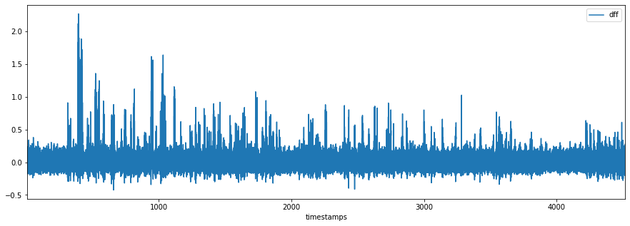
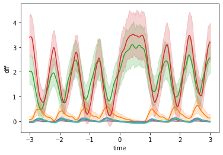
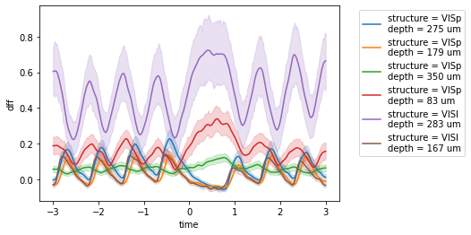
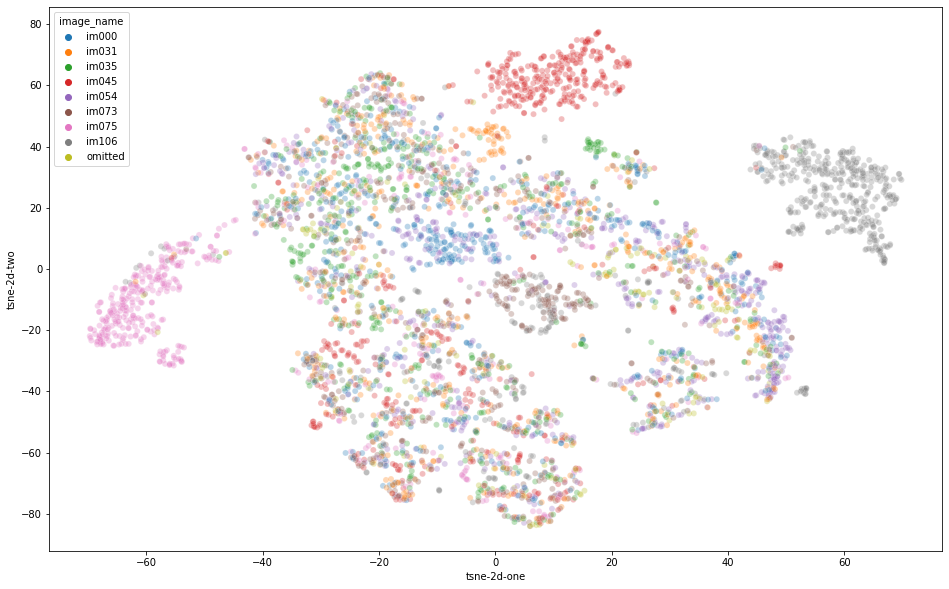
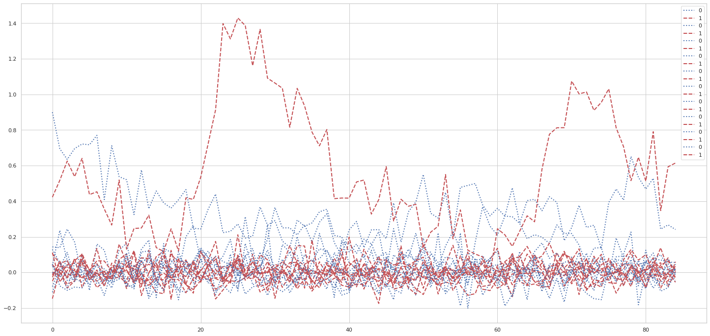

# Allen Visual Behavior 2P — Tutoriales y modelo de regresión

Repositorio con dos cuadernos sobre el **Allen Brain Observatory Visual Behavior 2P**: uno de tutorial con el SDK (datos tidy, respuestas evento-disparadas, decoding con scikit-learn) y otro con datos preprocesados (Figshare) y modelo de regresión para predecir licks a partir de actividad VIP/SST.

**Este material se desarrolló en el contexto de [Neuromatch Academy](https://neuromatch.io/academy/).**

---

## Contenido del repositorio

| Archivo | Descripción |
|--------|-------------|
| `Allen_Visual_Behavior_from_SDK.ipynb` | Tutorial: carga de sesiones con el SDK, formato tidy, respuestas a omisiones y estímulos, t-SNE y SVM para decodificar identidad de imagen. |
| `RegressionModelForAllenSDK_preprocessed.ipynb` | Análisis sobre datos preprocesados (parquet): células VIP y SST, “bolsas” por `stimulus_presentations_id`, trials de tipo catch, regresión logística y SVM para predecir *lick* (RESPONSE) a partir de las trazas. |
| `figures/` | Figuras exportadas desde los notebooks (usadas en este README). |

---

## Requisitos

- **Python 3**
- **mindscope_utilities** (incluye el Allen SDK):
  ```bash
  pip install mindscope_utilities --upgrade
  ```
- **Otros** (suelen instalarse con lo anterior): `numpy`, `pandas`, `matplotlib`, `seaborn`, `tqdm`, `scikit-learn`

El notebook del SDK está pensado para **Google Colab**: instalar `mindscope_utilities` y luego **reiniciar el runtime** antes de seguir.

---

## Cómo ejecutar

1. Clonar el repo (o descargar los notebooks).
2. Instalar dependencias (arriba). En Colab, ejecutar la celda de instalación y luego **RESTART RUNTIME**.
3. Abrir el notebook que quieras en Jupyter, Colab o VS Code.
4. Ejecutar las celdas en orden. La primera vez que se carga una sesión, el SDK descargará los NWB a la caché (p. ej. `/temp`); en ejecuciones siguientes se usa la caché local.

**Nota:** Se necesita acceso a red para descargar datos del S3 del Allen Institute. La ruta de caché (p. ej. `data_storage_directory = "/temp"`) debe existir o cambiarse por una ruta válida.

---

## Resultados principales

### 1. Notebook SDK (`Allen_Visual_Behavior_from_SDK.ipynb`)

- **Carga de datos:** Sesiones y experimentos desde el SDK; un único DataFrame “tidy” de actividad (ΔF/F, eventos) para todos los planos de una sesión.
- **Omisiones:** Respuestas evento-disparadas (ETR) alrededor de las omisiones de estímulo; diferencias claras entre planos/áreas en la respuesta media de células Sst.
- **Estímulos:** ETR por tipo de estímulo (8 imágenes + omisiones); visualización de respuestas medias por célula o por plano.
- **Decodificación:** Matriz trials × células; t-SNE en 2D; SVM para predecir identidad de imagen. Algunas imágenes (p. ej. im035, im075, im106) se decodifican mejor que otras (p. ej. im000 y omisiones).

Algunas de las figuras representativas del tutorial:

| Descripción | Figura |
|-------------|--------|
| Respuesta evento-disparada a omisiones (ejemplo de célula) |  |
| Respuesta media por plano de imagen (Sst, omisiones) |  |
| Respuestas a distintos estímulos (una célula) |  |
| Proyección t-SNE y matriz de confusión del decoder SVM |  |

---

### 2. Notebook de regresión (`RegressionModelForAllenSDK_preprocessed.ipynb`)

- **Datos:** Parquet preprocesado (Figshare); tarea de cambio de detección (CD); *licks* como variable de respuesta (RESPONSE).
- **Células:** VIP (`Vip-IRES-Cre`) y SST (`Sst-IRES-Cre`); “bolsas” agrupadas por `stimulus_presentations_id`.
- **Trials catch:** Análisis centrado en trials de tipo catch (falsas alarmas cuando aplica).
- **Modelo:** Regresión logística y SVM para predecir *lick* (RESPONSE) a partir de las trazas de actividad (VIP/SST); evaluación de cómo la actividad de estas poblaciones se relaciona con la decisión de licking.

Figura representativa del análisis de regresión:

| Descripción | Figura |
|-------------|--------|
| Resultado del modelo (regresión logística / SVM) para predecir lick desde trazas VIP/SST |  |

---

## Conceptos de datos (SDK)

- **Sesión:** Una sesión de comportamiento/imaging; identificada por `ophys_session_id`.
- **Experimento:** Un plano de imagen (un FOV); identificado por `ophys_experiment_id`. Una sesión de mesoscopio puede tener hasta 8 experimentos (p. ej. 2 áreas × 4 profundidades).
- **Formato tidy:** Una fila por observación (p. ej. un timestep por célula); columnas como `dff`, `events`, `filtered_events`.
- **Omisiones:** Trials donde no se presentó el flash esperado; se usan para calcular promedios ETR frente a omisiones.

---

## Licencia y atribución

- Los **datos y el SDK del Allen Brain Observatory** están sujetos a los términos y licencias del Allen Institute.
- **Neuromatch Academy:** Estos tutoriales se elaboraron en el contexto de Neuromatch Academy. Más información: [Neuromatch Academy](https://neuromatch.io/academy/).

---

## Exportar figuras desde los notebooks

Para regenerar las imágenes en `figures/`:

```bash
python scripts/extract_notebook_figures.py Allen_Visual_Behavior_from_SDK.ipynb --out figures/sdk --max 10
python scripts/extract_notebook_figures.py RegressionModelForAllenSDK_preprocessed.ipynb --out figures/regression --max 5
```
